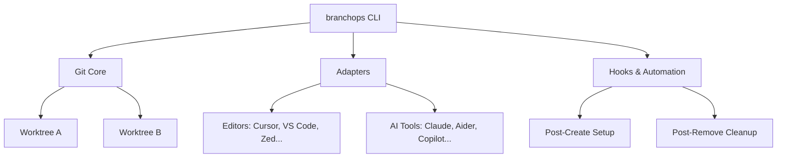
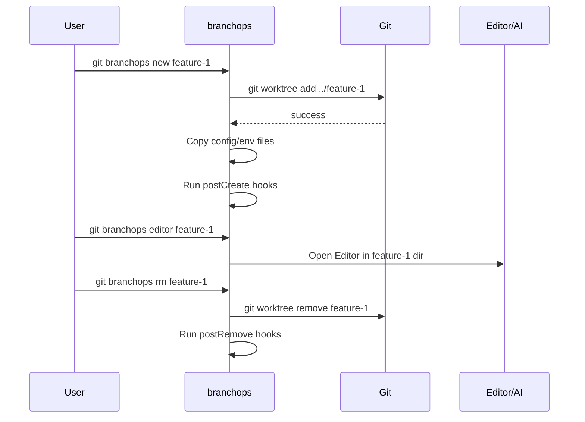

# branchops

> **Modern Git Worktree Orchestration for Parallel Development**

[](https://github.com/neopilot-ai/np-branchops/stargazers)
[](LICENSE)
[](https://www.gnu.org/software/bash/)
[](https://git-scm.com/)
[](#platform-support)
[](CONTRIBUTING.md)

---

## 📖 Table of Contents

- [🚀 Overview](#-overview)
- [🏆 Why Teams Adopt branchops](#-why-teams-adopt-branchops)
- [📸 Demo](#-demo)
- [⚡ Quick Start](#-quick-start)
- [🏃 Daily Workflow](#-daily-workflow)
- [✨ Why branchops?](#-why-branchops)
- [📐 Architecture & Workflow](#-architecture--workflow)
- [🌟 Features](#-features)
- [🧩 Commands Overview](#-commands-overview)
- [⚙️ Configuration](#️-configuration)
- [🖥️ Platform Support](#️-platform-support)
- [🤝 Contributing](#-contributing)

## 🚀 Overview


**branchops** is a portable, cross-platform CLI that makes **Git worktrees practical, fast, and enjoyable**.

It is designed for **modern parallel development**:

* Feature development alongside hotfixes
* Reviewing PRs without context switching
* Running tests on `main` while building features
* Spinning up **multiple AI agents on different branches**

If Git worktrees are powerful but painful, **branchops is the missing UX layer**.

---

## 🏆 Why Teams Adopt branchops

Engineering teams use `branchops` to eliminate the "branch switching tax" and enable high-velocity parallel workflows.

1. **Zero-Stash Workflow**: Stop stashing half-finished work. Just spin up a new worktree and keep your context.
2. **Instant PR Reviews**: Review a teammate's PR in a dedicated directory without touching your active workspace.
3. **AI-Ready Infrastructure**: The first tool designed to coordinate multiple AI agents working on different branches simultaneously.
4. **Onboarding in Seconds**: Automate environment setup (env files, npm install, etc.) for every new branch worktree.
5. **Clean Repos**: Automated cleanup of merged branches and stale worktrees keeps your development machine tidy.

---

## 📸 Demo

[](https://github.com/neopilot-ai/np-branchops)

> **Note:** We are currently recording a high-quality terminal GIF. In the meantime, you can explore the [Quick Start](#-quick-start) to see it for yourself!

---

## 🧠 What Are Git Worktrees? (Quick Explanation)

Normally, one repository directory = one checked-out branch.

Git worktrees allow **multiple branches to be checked out simultaneously**, each in its own directory:

```text
repo/            → main
repo-feature/    → feature branch
repo-hotfix/     → hotfix branch
```

### The Reality Today

* Switching branches breaks flow
* Stashing is fragile
* Reviewing PRs interrupts active work
* Parallel automation / AI workflows are difficult

### The Problem

Git worktrees exist — but the CLI is verbose, manual, and error-prone.

### The Solution

**branchops** wraps `git worktree` with:

* Clean commands
* Smart defaults
* Editor & AI integration
* Automation hooks

---

## ⚡ Quick Start

### Installation

```bash
git clone https://github.com/neopilot-ai/np-branchops.git
cd np-branchops
./install.sh
```

> **Upgrade**: Run `./install.sh --upgrade` to reinstall over the existing version.  
> **Uninstall**: Run `./install.sh --uninstall` to remove all binaries and config files.


<details>
<summary><b>Manual installation options</b></summary>

**macOS (Homebrew):**

```bash
ln -s "$(pwd)/bin/git-branchops" "$(brew --prefix)/bin/git-branchops"
```

**Linux / macOS (Intel):**

```bash
sudo mkdir -p /usr/local/bin
sudo ln -s "$(pwd)/bin/git-branchops" /usr/local/bin/git-branchops
```

**User-local:**

```bash
mkdir -p ~/bin
ln -s "$(pwd)/bin/git-branchops" ~/bin/git-branchops
export PATH="$HOME/bin:$PATH"
```

</details>

---

## 🏃 Daily Workflow

```bash
# One-time per repo setup
git branchops config set branchops.editor.default cursor
git branchops config set branchops.ai.default claude

# Create worktrees
git branchops new my-feature
git branchops new my-feature --editor
git branchops new my-feature --ai
git branchops new my-feature -e -a

# Navigate & run
git branchops editor my-feature
git branchops ai my-feature
git branchops run my-feature npm test

# Cleanup
git branchops rm my-feature
git branchops clean --merged

# 🎭 Advanced: Using Presets
# Define a "frontend" setup once, use it everywhere
git branchops config set branchops.preset.frontend.copy.include "**/.env.local"
git branchops config set branchops.preset.frontend.hooks.postCreate "npm install"

# Spin up a full environment in one command
git branchops new feature-login --preset frontend --editor
```

---

## ✨ Why branchops?

| Workflow        | Raw Git        | branchops                      |
| --------------- | -------------- | ------------------------------ |
| Create worktree | Verbose paths  | `git branchops new feature`    |
| Open editor     | Manual `cd`    | `git branchops editor feature` |
| Start AI tool   | Manual setup   | `git branchops ai feature`     |
| Copy env/config | Manual         | Automatic rules                |
| Run setup       | Manual scripts | Hooks                          |
| Cleanup         | Error-prone    | Smart clean                    |

**TL;DR**: Same Git power — dramatically better DX.

---

## 📐 Architecture & Workflow

### How it Works
`branchops` acts as a coordination layer between Git, your editors, and automation scripts.



### The branchops Lifecycle



---

## 🌟 Features

* Intuitive CLI for Git worktrees
* Repository-scoped worktree management
* Configuration-first design
* Editor integrations (Cursor, VS Code, Zed, more)
* AI coding tools (Claude, Gemini, Aider, Copilot, Cursor...)
* Smart file copying (env/config sync)
* Post-create / post-remove hooks
* Shared team configuration via `.branchopsconfig`
* Parallel workflows & automation-friendly
* Bash, Zsh, Fish completions
* Cross-platform support

---

## 🧩 Commands Overview

```bash
git branchops new <branch>
git branchops editor <branch>
git branchops ai <branch>
git branchops run <branch> <cmd>
git branchops go <branch>
git branchops list
git branchops rm <branch>
git branchops clean
git branchops config
```

Run `git branchops help` for full reference.

---

## ⚙️ Configuration

Configuration uses **git config** and supports team sharing.

```bash
git branchops config set branchops.editor.default cursor
git branchops config set branchops.ai.default claude
git branchops config add branchops.copy.include "**/.env.example"
git branchops config add branchops.hook.postCreate "npm install"
```

### Team Defaults (`.branchopsconfig`)

```gitconfig
[defaults]
    editor = cursor
    ai = claude

[copy]
    include = **/.env.example

[hooks]
    postCreate = npm install
```

Precedence:

1. Local repo config
2. `.branchopsconfig`
3. Global git config

---

## 🖥️ Platform Support

| Platform | Status     | Notes                |
| -------- | ---------- | -------------------- |
| macOS    | ✅ Full     | Ventura+ recommended |
| Linux    | ✅ Full     | Ubuntu, Fedora, Arch |
| Windows  | ⚠️ Partial | Git Bash / WSL only  |

---

## 🧠 Advanced Workflows

* Multiple worktrees per branch
* Parallel AI agents
* Non-interactive CI usage
* Repo bootstrapping scripts
* Large mono-repo workflows

➡️ Check out the [**Documentation Index**](docs/README.md) for deeper dives into:
- [Configuration](docs/configuration.md)
- [Editor & AI Adapters](docs/ADAPTERS.md)
- [Troubleshooting](docs/troubleshooting.md)

---

## 🤝 Contributing

Contributions are welcome:

* Editor adapters (JetBrains, Neovim)
* AI tool adapters
* Docs & tutorials
* Bug fixes

See **CONTRIBUTING.md** and **CODE_OF_CONDUCT.md**.

---

## 📄 License

Licensed under the **Apache License 2.0**.

---

Built for developers who work in parallel — with humans *and* AI.
